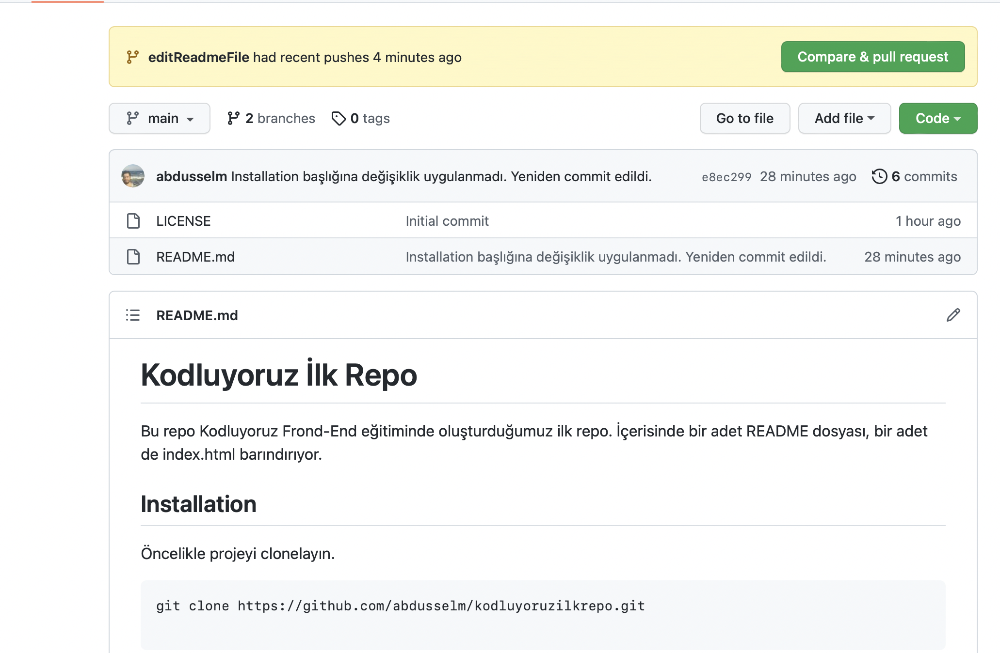

# Kodluyoruz İlk Repo
Bu repo [Kodluyoruz](https://kodluyoruz.org) Frond-End eğitiminde oluşturduğumuz ilk repo. İçerisinde bir adet README dosyası, bir adet de index.html barındırıyor.


## Installation
Öncelikle projeyi clonelayın.

```
git clone https://github.com/abdusselm/kodluyoruzilkrepo.git

```

## Usage
Projeyi cloneladıktan sonra Visual Studio Code programında açınız.

Linux İçin:
```
cd kodluyoruzilkrepo
code .
```

## Contributing
Pull requestler kabul edilir. Büyük değişiklikler için, lütfen önce neyi değiştirmek istediğinizi tartışmak için bir konu açınız.

## License

[MIT](https://opensource.org/licenses/MIT)